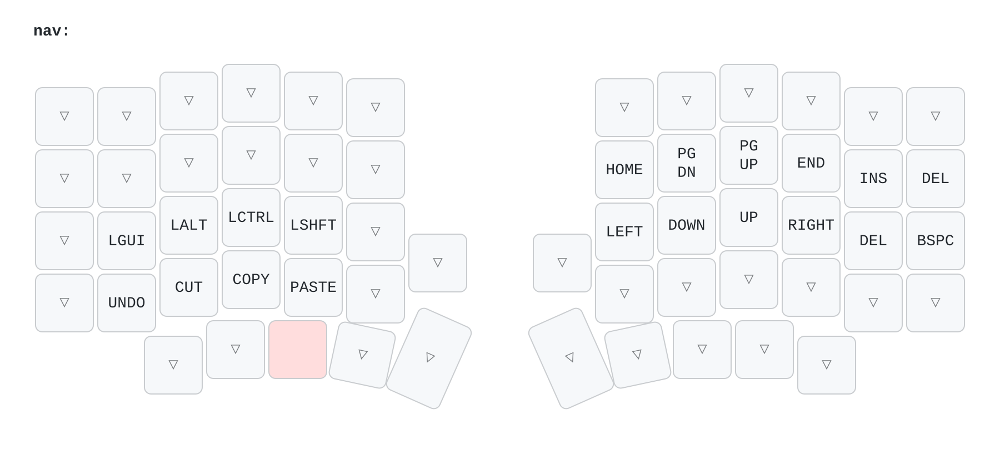
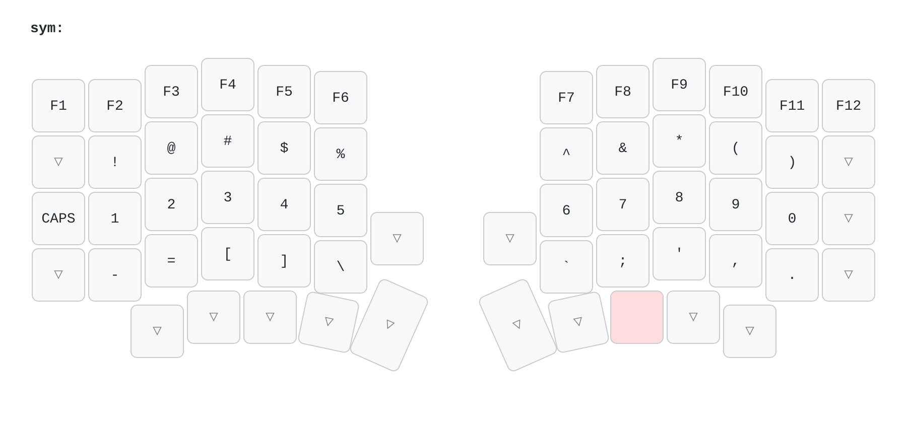
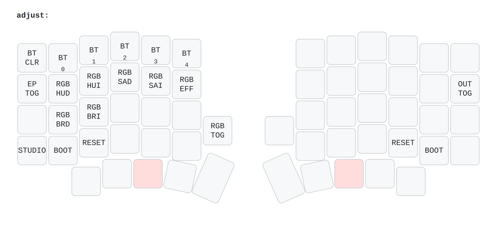

# ZMK-Config: Sofle Choc Pro

Meine Tastaturbelegung fuer die Sofle Choc Pro BT. Gebaut gegen ZMK v0.3.

## Ebenen

Die Basis-Ebene. Der linke Daumen gibt Space, der rechte Enter. Ctrl liegt auf beiden Daumen.


NAV halten: der linke Daumen greift eine Taste nach innen. Die Pfeile liegen dann auf H J K L.



SYM halten: der rechte Daumen greift eine Taste nach innen. Zeichen und F-Tasten links, Zahlen mittig.



ADJUST: beide Daumen greifen nach innen. Bluetooth, RGB und Bootloader.



## Belegung aendern ohne Flashen

Das ist der schnellste Weg. Diese Config aktiviert ZMK Studio. Studio aendert die Belegung live
ueber USB. Kein Build, kein Flashen, kein Neustart.

Einmalig noetig: Zugriff auf die serielle Schnittstelle.

```sh
sudo usermod -aG uucp $USER
```

Danach einmal ab- und wieder anmelden.

Dann jedes Mal:

1. Schliesse die **linke** Haelfte per USB-C an. Sie ist die zentrale Haelfte.
2. Oeffne <https://zmk.studio> in Chrome oder Edge. Firefox kann kein WebSerial.
3. Klicke **Connect** und waehle das serielle Geraet.
4. Entsperre die Tastatur: halte beide inneren Daumentasten (NAV + SYM) und druecke die linke
   Shift-Taste. Ohne diesen Griff bleibt Studio schreibgeschuetzt.
5. Aendere die Tasten und speichere. Die Aenderung gilt sofort.

Studio kann Tasten neu belegen und zwischen den Ebenen verschieben. Es kann **keine** neuen
Verhalten anlegen, keine Combos und nichts in `config/sofle_choc_pro.conf` aendern. Dafuer
brauchst du einen neuen Build.

> Studio schreibt seine Belegung in den Flash-Speicher. Diese hat Vorrang vor der kompilierten.
> Ein spaeter geflashtes `.uf2` bleibt dann unsichtbar. Der naechste Abschnitt loest das.

## Firmware aufspielen

GitHub Actions baut die Firmware bei jedem Push. Danach erledigt ein Skript den Rest:

```sh
git push
./flash.sh
```

Das Skript holt den neuesten gruenen Build **deines aktuellen Branches**, wartet auf das
Bootloader-Laufwerk, kopiert die richtige Datei und macht danach mit der zweiten Haelfte weiter.
Du musst nur zweimal auf Reset druecken, wenn es dazu auffordert.

| Aufruf | Wirkung |
|---|---|
| `./flash.sh` | beide Haelften nacheinander |
| `./flash.sh left` | nur die linke Haelfte |
| `./flash.sh right` | nur die rechte Haelfte |
| `./flash.sh --reset` | beide Haelften mit dem `settings_reset`-Build |

Das Skript braucht `gh` (angemeldet mit `gh auth login`) und `udisksctl` aus `udisks2`.

### Von Hand

Falls das Skript nicht laufen kann:

1. Lade auf GitHub unter **Actions** beim obersten gruenen Lauf das Artefakt `firmware`
   herunter und entpacke es. Es enthaelt vier Dateien:

   | Datei | Zweck |
   |---|---|
   | `sofle_choc_pro_left-zmk.uf2` | linke Haelfte, normale Firmware |
   | `sofle_choc_pro_right-zmk.uf2` | rechte Haelfte, normale Firmware |
   | `settings_reset-sofle_choc_pro_left-zmk.uf2` | linke Haelfte, loescht den Speicher |
   | `settings_reset-sofle_choc_pro_right-zmk.uf2` | rechte Haelfte, loescht den Speicher |

2. Schliesse **eine** Haelfte per USB-C an.
3. Druecke zweimal schnell auf den Reset-Knopf. Alternativ: halte NAV + SYM und druecke `Z` fuer
   die linke Haelfte, `/` fuer die rechte.
4. Ein USB-Laufwerk erscheint. Kopiere die passende `.uf2`-Datei darauf.
5. Das Laufwerk verschwindet von selbst. Die Haelfte startet neu. Das ist das Zeichen fuer Erfolg.
6. Wiederhole Schritt 2 bis 5 mit der anderen Haelfte.

> **Achtung:** Spiele nie die `left`-Datei auf die rechte Haelfte. Die Haelften erkennen sich
> danach nicht mehr.

Beide Haelften verbinden sich nach dem Flashen von selbst wieder.

Zum Koppeln mit dem Rechner: Halte NAV + SYM und druecke eine der Tasten `1` bis `5`. Jede Taste
ist ein Bluetooth-Profil. `` ` `` loescht das aktive Profil. NAV + SYM + `Backspace` schaltet
zwischen USB und Bluetooth um.

## Wenn die neue Belegung nicht erscheint

Diese Config aktiviert ZMK Studio (`CONFIG_ZMK_STUDIO=y` in `build.yaml`). Studio speichert
Belegungen im Flash-Speicher. Diese gespeicherte Belegung hat Vorrang vor der kompilierten.
Eine neu geflashte Keymap bleibt dann unsichtbar.

So loescht du den Speicher:

```sh
./flash.sh --reset   # loescht den Speicher beider Haelften
./flash.sh           # spielt die normale Firmware wieder auf
```

Der Reset loescht auch alle Bluetooth-Profile und jede in Studio gespeicherte Belegung. Koppel
die Tastatur danach neu.

## Keymap aendern

Die Keymap liegt in `config/sofle_choc_pro.keymap`. Die Einstellungen liegen in
`config/sofle_choc_pro.conf`.

Pruefe jede Aenderung vor dem Push:

```sh
python3 check_keymap.py
```

Das Skript zaehlt die Bindungen. Jede Ebene muss genau 60 Tasten und 2 Encoder binden. Ein
falscher Zaehler bricht sonst erst im GitHub-Build ab.

## Keymap-Bilder erzeugen

```sh
./draw_keymap.sh
```

Das Skript schreibt fuenf PNG-Dateien nach `img/`: ein Gesamtbild und eines je Ebene. Fuehre es
nach jeder Aenderung an der Keymap aus, damit die Bilder oben stimmen.

Es braucht zwei Programme:

| Programm | Arch Linux |
|---|---|
| `uvx` (aus uv) | `sudo pacman -S uv` |
| `rsvg-convert` | `sudo pacman -S librsvg` |

`uvx` laedt [keymap-drawer](https://github.com/caksoylar/keymap-drawer) bei Bedarf selbst nach.
Eine Installation ist nicht noetig. Die Beschriftungen, die keymap-drawer nicht von selbst kennt,
stehen in `keymap_drawer.config.yaml`.
