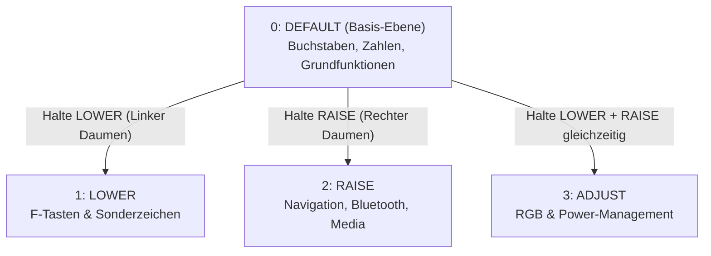
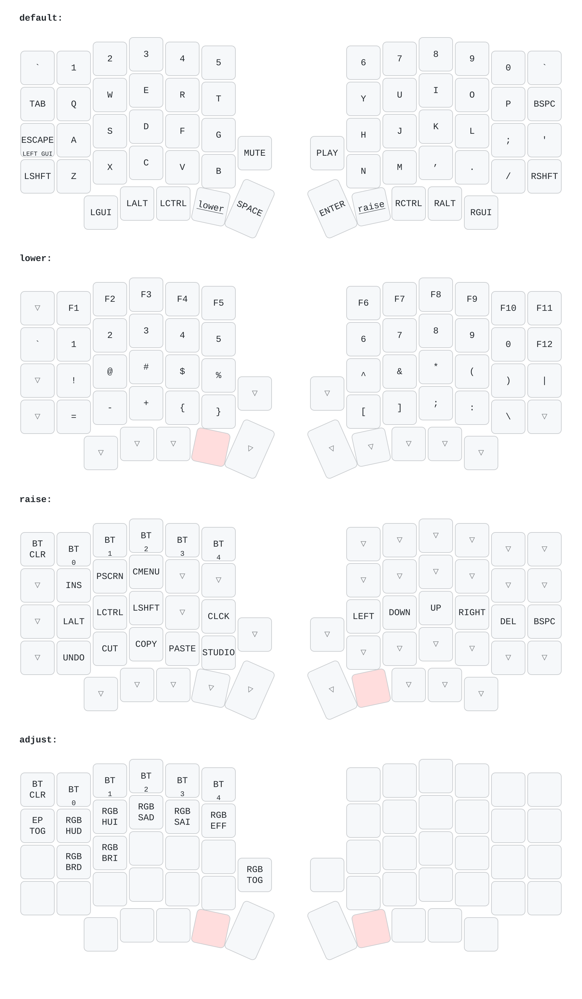
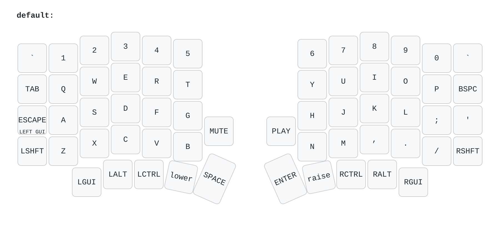
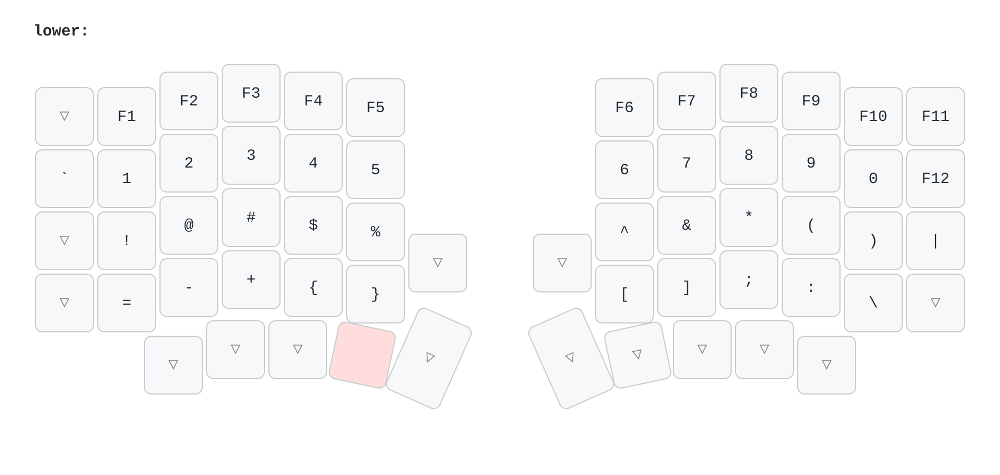
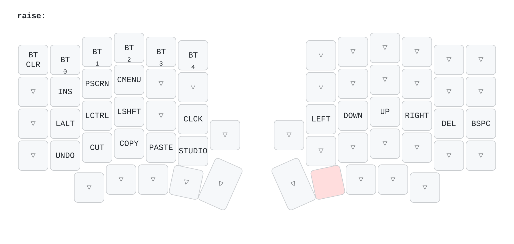

# Sofle Choc Pro ZMK Configuration

Dieses Repository enthält die ZMK-Firmware-Konfiguration für die **Sofle Choc Pro** (eine ergonomische, geteilte Low-Profile-Tastatur mit Drehreglern und RGB-Underglow).

---

## 📑 Inhaltsverzeichnis

1. [Benutzerhandbuch & Schnelleinstieg](#-benutzerhandbuch--schnelleinstieg)
   - [Das Split-Keyboard-Prinzip](#1-das-split-keyboard-prinzip)
   - [Das Ebenen-System (Layer-Konzept)](#2-das-ebenen-system-layer-konzept)
   - [Dual-Funktionstasten (Mod-Tap / Hold-Tap)](#3-dual-funktionstasten-mod-tap--hold-tap)
   - [Drehregler (Rotary Encoders)](#4-drehregler-rotary-encoders)
   - [Bluetooth: Kopplung & Profilverwaltung](#5-bluetooth-kopplung--profilverwaltung)
   - [RGB-Beleuchtung & Stromspar-Tipps](#6-rgb-beleuchtung--stromspar-tipps)
   - [ZMK Studio (Live Keymap Editor)](#7-zmk-studio-live-keymap-editor)
2. [Tasten-Lexikon & Abkürzungsverzeichnis](#-tasten-lexikon--abkürzungsverzeichnis)
   - [Bluetooth & System](#bluetooth--system)
   - [Stromversorgung & RGB-Beleuchtung](#stromversorgung--rgb-beleuchtung)
   - [Navigation, Bearbeitung & Zwischenablage](#navigation-bearbeitung--zwischenablage)
   - [Modifikatoren & ZMK-Spezialtasten](#modifikatoren--zmk-spezialtasten)
3. [Tastenbelegung nach Ebenen (Keymap Layers)](#-tastenbelegung-nach-ebenen-keymap-layers)
4. [Firmware erstellen (How to Build)](#-firmware-erstellen-how-to-build)
5. [Firmware flashen (How to Flash)](#-firmware-flashen-how-to-flash)
6. [Keymap-Grafiken generieren](#-keymap-grafiken-generieren)
7. [Verzeichnisstruktur](#-verzeichnisstruktur)

---

## 📖 Benutzerhandbuch & Schnelleinstieg

### 1. Das Split-Keyboard-Prinzip

Die **Sofle Choc Pro** besteht aus zwei separaten Hälften (Links und Rechts), die für eine natürliche, schulterbreite Handhaltung sorgen.
- **Linke Hälfte (Master / Central):** Die linke Seite übernimmt die Hauptverbindung zu Ihrem Computer (entweder über USB-C oder drahtlos per Bluetooth).
- **Rechte Hälfte (Peripheral):** Die rechte Seite kommuniziert kabellos via Bluetooth Low Energy (BLE) mit der linken Hälfte.
- **Daumentasten (Thumb Cluster):** Die Daumen übernehmen wichtige Funktionen wie `Space`, `Enter`, Modifikatoren (`Ctrl`, `Alt`, `GUI`) und das Umschalten der Ebenen (`LOWER`, `RAISE`).

> [!NOTE]
> Wenn Sie die Tastatur per USB nutzen, verbinden Sie stets die **linke Hälfte** mit Ihrem PC.

---

### 2. Das Ebenen-System (Layer-Konzept)

Da kompakte 58-Tasten-Tastaturen weniger Tasten haben als Standardtastaturen, werden zusätzliche Zeichen und Funktionen über **Ebenen (Layers)** erreicht:



1. **Layer 0 (`default`):** Standard-Schreibebene mit Buchstaben, Zahlen (oberste Reihe), Pfeiltasten über Daumen/Layer und Standard-Satzzeichen.
2. **Layer 1 (`lower`):** Wird aktiviert, indem Sie die Daumentaste **`LOWER` gedrückt halten**.
   - Zugriff auf **F1 bis F12**.
   - Alle Programmier- und Sonderzeichen (`!`, `@`, `#`, `$`, `%`, `{`, `}`, `[`, `]`, `\`, `|`, etc.).
3. **Layer 2 (`raise`):** Wird aktiviert, indem Sie die Daumentaste **`RAISE` gedrückt halten**.
   - **Bluetooth-Steuerung** (`BT1`–`BT5`, `BTCLR`).
   - **Navigations-Cluster** (Pfeiltasten `←` `↓` `↑` `→`, `PgUp`, `PgDn`, `Del`, `Backspace`).
   - **Zwischenablage & Bearbeiten** (`Undo`, `Cut`, `Copy`, `Paste`, `Caps Lock`, `Print Screen`).
   - **ZMK Studio Freischaltung** (`STUDIO`).
4. **Layer 3 (`adjust` / Tri-Layer):** Aktiviert sich automatisch, wenn Sie **`LOWER` und `RAISE` gleichzeitig gedrückt halten**.
   - Steuerung der RGB-Underglow-Beleuchtung (Farbe, Sättigung, Helligkeit, Effekte).
   - `EXTPWR` (Abschalten der Stromversorgung für maximale Akkulaufzeit).

---

### 3. Dual-Funktionstasten (Mod-Tap / Hold-Tap)

Einige Tasten verhalten sich je nach Anschlagsart unterschiedlich:
- **`ESC / GUI` (oben links in der Home-Reihe, neben `A`):**
  - **Kurz antippen (Tap):** Sendet die **`Escape` (ESC)** Taste.
  - **Gedrückt halten (Hold):** Wirkt als **`GUI`** (Windows-Taste unter Windows, Command `⌘` auf dem Mac, Super-Taste unter Linux).

---

### 4. Drehregler (Rotary Encoders)

Jede Hälfte verfügt über einen klickbaren Drehregler mit folgenden Funktionen:

| Drehregler | Aktion | Ebene | Funktion |
| :--- | :--- | :--- | :--- |
| **Links** | Drehen im Uhrzeigersinn | Alle Ebenen | **Lautstärke lauter** (`VOL+`) |
| **Links** | Drehen gegen Uhrzeigersinn | Alle Ebenen | **Lautstärke leiser** (`VOL-`) |
| **Links** | Taste / Klick | Alle Ebenen | **Stummschalten** (`MUTE`) |
| **Rechts** | Drehen im Uhrzeigersinn | `default` | **Nach unten scrollen** (`Scroll Down`) |
| **Rechts** | Drehen gegen Uhrzeigersinn | `default` | **Nach oben scrollen** (`Scroll Up`) |
| **Rechts** | Drehen im Uhrzeigersinn | `lower` / `raise` | **Nächster Titel** (`NEXT`) |
| **Rechts** | Drehen gegen Uhrzeigersinn | `lower` / `raise` | **Vorheriger Titel** (`PREV`) |
| **Rechts** | Taste / Klick | Alle Ebenen | **Wiedergabe / Pause** (`PLAY`) |

---

### 5. Bluetooth: Kopplung & Profilverwaltung

Die Tastatur kann mit bis zu **5 verschiedenen Geräten** (PC, Laptop, Tablet, Smartphone etc.) gekoppelt werden:

#### Neues Gerät koppeln:
1. Halten Sie die Daumentaste **`RAISE`** (oder `LOWER` + `RAISE`) gedrückt.
2. Drücken Sie eine der Profil-Tasten **`BT1` bis `BT5`** (Zahlenreihe oben links).
3. Öffnen Sie an Ihrem Computer/Handy die Bluetooth-Einstellungen, suchen Sie nach **`Sofle Choc Pro`** und bestätigen Sie die Verbindung.

#### Gerät wechseln:
- Halten Sie `RAISE` gedrückt und tippen Sie das gewünschte Profil (`BT1` bis `BT5`) an. Die Tastatur verbindet sich sofort mit dem jeweiligen Gerät.

#### Verbindungsprobleme beheben (Profil zurücksetzen):
- Halten Sie `RAISE` gedrückt und tippen Sie auf **`BTCLR`**. Dadurch wird die Kopplung des aktuell aktiven Profils gelöscht und kann neu eingerichtet werden.

---

### 6. RGB-Beleuchtung & Stromspar-Tipps

Die Beleuchtung wird über die **`ADJUST`**-Ebene gesteuert (halten Sie **`LOWER` + `RAISE`**):

- **`RGB_TOG`:** Schaltet die RGB-Beleuchtung **Ein / Aus**.
- **`RGB_EFF`:** Wechselt durch verschiedene RGB-Effekte (Animationen, Farbverläufe, statisches Licht).
- **`RGB_HUI` / `RGB_HUD`:** Farbton (Hue) ändern (Farbkreis vor- oder zurückblättern).
- **`RGB_SAI` / `RGB_SAD`:** Farbsättigung erhöhen oder verringern.
- **`RGB_BRI` / `RGB_BRD`:** Helligkeit erhöhen oder dimmen.

> [!TIP]
> **Akkulaufzeit maximieren mit `EXTPWR` (`EP_TOG`):**
> Auf der `ADJUST`-Ebene (Taste oben links) schaltet **`EXTPWR`** die Stromversorgung für LEDs und Displays hardwareseitig komplett ab. Dies verlängert die Akkulaufzeit im kabellosen Betrieb drastisch von wenigen Tagen auf mehrere Wochen/Monate!

---

### 7. ZMK Studio (Live Keymap Editor)

Diese Firmware unterstützt **ZMK Studio**, womit Sie Tasten direkt im Browser oder in der ZMK Studio App ohne Neu-Flashen anpassen können:
1. Verbinden Sie die linke Hälfte per USB-Kabel mit dem PC.
2. Halten Sie **`RAISE`** gedrückt und drücken Sie die Taste **`STUDIO`** (untere linke Reihe, neben Paste).
3. Öffnen Sie [ZMK Studio](https://zmk.dev/) im Chrome/Edge-Browser und verbinden Sie sich per WebHID.

---

## 🔍 Tasten-Lexikon & Abkürzungsverzeichnis

Hier finden Sie eine verständliche Erklärung aller nicht selbsterklärenden Tastenabkürzungen:

### Bluetooth & System

| Tastenbeschriftung | ZMK-Binding | Erklärung |
| :--- | :--- | :--- |
| **`BT1` – `BT5`** | `&bt BT_SEL 0..4` | Wählt Bluetooth-Profil 1 bis 5 aus (für 5 verschiedene Geräte). |
| **`BTCLR`** | `&bt BT_CLR` | Löscht die Bluetooth-Kopplungsdaten des aktuell ausgewählten Profils. |
| **`STUDIO` / `STUD`** | `&studio_unlock` | Entsperrt ZMK Studio für Live-Tastenbelegungsänderungen via USB. |
| **`BOOT`** | `&bootloader` | Versetzt den Controller in den Bootloader-Modus zum Flashen neuer Firmware. |
| **`RESET`** | `&sys_reset` | Führt einen Software-Neustart der Tastatur durch. |

### Stromversorgung & RGB-Beleuchtung

| Tastenbeschriftung | ZMK-Binding | Erklärung |
| :--- | :--- | :--- |
| **`EXTPWR` / `EP TOG`** | `&ext_power EP_TOG` | Schaltet die externe VCC-Stromversorgung für LEDs ab/ein (wichtig für Akku-Schonung). |
| **`RGB_TOG`** | `&rgb_ug RGB_TOG` | Schaltet die RGB-Hintergrundbeleuchtung Ein oder Aus. |
| **`RGB_EFF`** | `&rgb_ug RGB_EFF` | Schaltet zum nächsten RGB-Lichteffekt / Animationsmodus um. |
| **`RGB_HUI` / `RGB_HUD`** | `&rgb_ug RGB_HUI` / `HUD` | **H**ue **I**ncrease / **D**ecrease: Ändert den Farbton (z. B. Rot → Grün → Blau). |
| **`RGB_SAI` / `RGB_SAD`** | `&rgb_ug RGB_SAI` / `SAD` | **Sa**turation **I**ncrease / **D**ecrease: Erhöht oder verringert die Farbsättigung. |
| **`RGB_BRI` / `RGB_BRD`** | `&rgb_ug RGB_BRI` / `BRD` | **Br**ightness **I**ncrease / **D**ecrease: Erhöht oder verringert die Helligkeit. |

### Navigation, Bearbeitung & Zwischenablage

| Tastenbeschriftung | ZMK-Binding | Erklärung |
| :--- | :--- | :--- |
| **`LEFT` / `DOWN` / `UP` / `RIGHT`** | `&kp LEFT/DOWN/UP/RIGHT` | Pfeiltasten zur Cursor-Navigation (auf der rechten Hand unter den Fingern `J`, `K`, `I`, `L`). |
| **`PGUP` / `PGDN`** | `&kp PG_UP` / `&kp PG_DN` | **Bild auf** / **Bild ab** (seitenweises Scrollen). |
| **`INS`** | `&kp INS` | **Einfügen**-Taste (Insert). |
| **`DEL`** | `&kp DEL` | **Entfernen**-Taste (löscht Zeichen rechts vom Cursor). |
| **`BSPC` / `BKSPC`** | `&kp BSPC` | **Backspace** / Rücktaste (löscht Zeichen links vom Cursor). |
| **`PSCR` / `PSCRN`** | `&kp PSCRN` | **Drucken / Screenshot** (Print Screen). |
| **`CMENU`** | `&kp K_CMENU` | **Kontextmenü-Taste** (entspricht einem Rechtsklick an der Cursor-Position). |
| **`CLCK`** | `&kp CLCK` | **Caps Lock** (Dauerhafte Großschreibung feststellen). |
| **`UNDO`** | `&kp K_UNDO` | **Rückgängig machen** (entspricht Strg + Z). |
| **`CUT`** | `&kp K_CUT` | **Ausschneiden** in die Zwischenablage (entspricht Strg + X). |
| **`COPY`** | `&kp K_COPY` | **Kopieren** in die Zwischenablage (entspricht Strg + C). |
| **`PASTE`** | `&kp K_PASTE` | **Einfügen** aus der Zwischenablage (entspricht Strg + V). |
| **`MUTE`** | `&kp C_MUTE` | Ton stummschalten / Lautstärke ein. |
| **`PLAY`** | `&kp C_PLAY` | Medienwiedergabe starten oder pausieren. |

### Modifikatoren & ZMK-Spezialtasten

| Tastenbeschriftung | ZMK-Binding | Erklärung |
| :--- | :--- | :--- |
| **`GUI` / `LGUI` / `RGUI`** | `&kp LGUI` / `RGUI` | **Windows-Taste** / **Command `⌘`** (Mac) / **Super** (Linux). |
| **`ALT` / `LALT` / `RALT`** | `&kp LALT` / `RALT` | **Alt-Taste** (bzw. `Option ⌥` auf Mac). `RALT` fungiert als **AltGr**. |
| **`CTRL` / `LCTRL` / `RCTRL`** | `&kp LCTRL` / `RCTRL` | **Steuerungs-Taste** (`Strg` / `Ctrl`). |
| **`SHIFT` / `LSHFT` / `RSHFT`** | `&kp LSHFT` / `RSHFT` | **Umschalttaste** für Großbuchstaben. |
| **`GRAVE` / `` ` ``** | `&kp GRAVE` | Backtick / Gravis (und Tilde `~` mit Shift). |
| **`trans` / `▽`** | `&trans` | **Transparent:** Die Taste leitet den Tastendruck an die darunterliegende Ebene (`default`) weiter. |
| **`none`** | `&none` | **Deaktiviert:** Auf dieser Ebene ohne Funktion (verhindert Fehlbedienung). |

---

## 🗺️ Tastenbelegung nach Ebenen (Keymap Layers)

### Gesamtübersicht



<details>
<summary><b>🔍 Einzelne Ebenen anzeigen (Hier aufklappen)</b></summary>

#### 1. Default Layer (Basis)


#### 2. Lower Layer (F-Tasten & Sonderzeichen)


#### 3. Raise Layer (Navigation, Bluetooth & Studio)


#### 4. Adjust Layer (RGB-Licht & Power-Management)


</details>

---

## 🛠️ Firmware erstellen (How to Build)

GitHub Actions baut die Firmware automatisch bei jedem Push in dieses Repository:

1. Änderungen zu GitHub committen und pushen:
   ```bash
   git add .
   git commit -m "Update keymap configuration"
   git push origin main
   ```
2. Öffnen Sie den Reiter **Actions** im GitHub-Repository.
3. Wählen Sie den neuesten Workflow-Lauf aus.
4. Laden Sie das Archiv `firmware.zip` aus dem Abschnitt **Artifacts** herunter.
5. Nach dem Entpacken erhalten Sie folgende `.uf2`-Dateien:
   - `sofle_choc_pro_left-zmk.uf2` (Linke Hälfte)
   - `sofle_choc_pro_right-zmk.uf2` (Rechte Hälfte)
   - `sofle_choc_pro_left-settings_reset-zmk.uf2` (Reset-Firmware für links)
   - `sofle_choc_pro_right-settings_reset-zmk.uf2` (Reset-Firmware für rechts)

---

## ⚡ Firmware flashen (How to Flash)

1. Schließen Sie die **linke Hälfte** der Tastatur per USB-C-Kabel an Ihren Computer an.
2. Versetzen Sie die Hälfte in den **Bootloader-Modus**:
   - Drücken Sie den physischen Reset-Taster auf dem Board **zweimal schnell hintereinander**, oder
   - Drücken Sie die Taste `BOOT` auf der Tastatur.
3. Ein neues Wechsellaufwerk namens **`NICENANO`** erscheint auf Ihrem Computer.
4. Kopieren Sie die Datei **`sofle_choc_pro_left-zmk.uf2`** auf das Laufwerk `NICENANO`.
5. Das Laufwerk trennt sich nach dem Schreibvorgang automatisch und die Tastatur startet neu.
6. Wiederholen Sie dieselben Schritte für die **rechte Hälfte** mit der Datei **`sofle_choc_pro_right-zmk.uf2`**.

> [!IMPORTANT]
> Sollten Probleme bei der Bluetooth-Verbindung zwischen den beiden Hälften auftreten, flashen Sie zunächst auf beiden Hälften die jeweilige `settings_reset-zmk.uf2` Datei, um die Konfiguration zurückzusetzen, und anschließend die reguläre Firmware neu.

---

## 🎨 Keymap-Grafiken generieren

Sie können die visuellen Tastenbelegungs-Grafiken lokal mit dem Skript `draw_keymap.sh` aktualisieren.

### Voraussetzungen
Installieren Sie folgende Hilfsprogramme:
- `uv` (oder `uvx`)
- `rsvg-convert` (Paket `librsvg`)
- `python3` mit `pyyaml`

### Skript ausführen
```bash
./draw_keymap.sh
```

Das Skript generiert die PNG-Dateien im Ordner `img/`:
- `img/keymap.png`: Gesamtübersicht aller Ebenen
- `img/keymap-<layer>.png`: Diagramme der einzelnen Ebenen

---

## 📁 Verzeichnisstruktur

- `boards/arm/sofle_choc_pro/`: Hardware- und Board-Definitionen (DTS/DTSI, Pinbelegung).
- `config/sofle_choc_pro.keymap`: Tastenbelegung (Keymap) und Layer-Definitionen.
- `config/sofle_choc_pro.conf`: Feature- und Energiespar-Konfiguration (Bluetooth, Deep Sleep, etc.).
- `build.yaml`: GitHub Actions Build-Matrix-Datei.
- `draw_keymap.sh`: Shell-Skript zur visuellen Keymap-Generierung.
- `img/`: Generierte Keymap-Grafiken.

